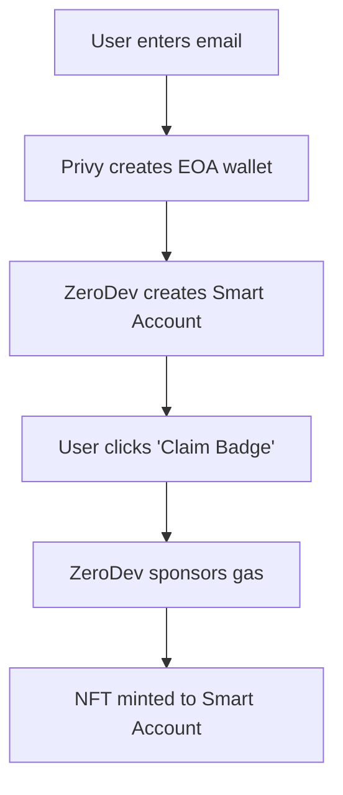

# ZeroDev × Privy Demo: Frontend walkthrough

A comprehensive tutorial demonstrating the "magic" of account abstraction using **Privy** for email-based authentication and **ZeroDev** for sponsored smart account transactions.

## 🎯 What This Demo Does

This application showcases how to create a seamless Web3 experience where users can:

1. **Log in with just their email** (no wallet installation required)
2. **Get both an EOA and Smart Account** automatically
3. **Mint NFTs with sponsored transactions** using account abstraction
4. **Batch multiple contract calls** into a single UserOperation
5. **Grant session keys** so repeat actions need no extra prompts
6. **Experience true Web2-like UX** in Web3

## 🧪 Available demos in this app

The landing page (`/src/components/HomePage.tsx`) links to three flows. You can open them directly while running `npm run dev`:

| Route | What it shows | Key files |
| --- | --- | --- |
| `/simple-login-mint` | "Hello, AA" onboarding & sponsored NFT mint | `src/app/simple-login-mint/components/MagicMint.tsx` |
| `/batch-operations` | Compose multiple `mint()` calls into one UserOperation with live status updates | `src/app/batch-operations/components/BatchOperations.tsx` + `src/app/batch-operations/lib/userOps.ts` |
| `/session-keys` | Grant/revoke a scoped session key with time/usage limits and mint without prompts | `src/app/session-keys/components/SessionKeyDemo.tsx` + `src/app/session-keys/lib/sessionKeys.ts` |

Shared utilities live under `src/lib/` (smart account setup, contract ABI) so each demo focuses on its unique UX.

## 🏗️ Architecture Overview

### Core Technologies

- **Frontend**: Next.js 15 with TypeScript and Tailwind CSS
- **Authentication**: Privy (email-based social login)
- **Account Abstraction**: ZeroDev SDK v5 (smart accounts & gas sponsorship)
- **Blockchain**: Ethereum Sepolia testnet
- **Web3 Library**: viem

### How It Works (simple login & mint)



## 🚀 Quick Start

### Prerequisites

1. **Privy Account**: Sign up at [privy.io](https://privy.io)
2. **ZeroDev Account**: Sign up at [zerodev.app](https://zerodev.app)
3. **Deployed NFT Contract**: We'll use the MagicBadge contract on Sepolia

### 1. Dashboard Setup

#### Privy Dashboard Configuration

1. Go to [dashboard.privy.io](https://dashboard.privy.io)
2. Create a new app or select existing one
3. Configure the following settings:
   - **Login Methods**: Enable "Email" only
   - **Embedded Wallets**: Enable "Create on login for users without wallets"
   - **Allowed Origins**: Add `http://localhost:3000` for development
4. Copy your **App ID** from the dashboard

#### ZeroDev Dashboard Configuration

1. Go to [dashboard.zerodev.app](https://dashboard.zerodev.app)
2. Create a new project or select existing one
3. Select **Sepolia** as your network
4. Configure **Paymaster**:
   - Create an "Ethereum Paymaster"
   - Fund it with at least 0.1 ETH on Sepolia
   - Note the paymaster RPC URL
5. Copy your **Project ID** and **RPC URLs**

### 2. Environment Setup

Create a `.env.local` file in the project root:

```bash
# Privy App ID (from dashboard.privy.io)
NEXT_PUBLIC_PRIVY_APP_ID=your_privy_app_id_here

# ZeroDev RPC endpoints (from dashboard.zerodev.app)
NEXT_PUBLIC_ZERODEV_BUNDLER_RPC=https://rpc.zerodev.app/api/v3/YOUR_PROJECT_ID/chain/11155111
NEXT_PUBLIC_ZERODEV_PAYMASTER_RPC=https://rpc.zerodev.app/api/v3/YOUR_PROJECT_ID/chain/11155111

# Deployed MagicBadge contract on Sepolia
NEXT_PUBLIC_NFT_CONTRACT_ADDRESS=0x7F07bf8A79d91478Fe7EAA4c39935b26F3A13980
```

### 3. Installation & Development

```bash
# Install dependencies
npm install

# Start development server
npm run dev
```

Open [http://localhost:3000](http://localhost:3000) to see the application.

## 🧩 Understanding the MagicMint component

The core functionality lives in `src/app/simple-login-mint/components/MagicMint.tsx`. Here's how it works:

### Key Imports and Setup

```typescript
import { usePrivy, useWallets } from '@privy-io/react-auth';
import {
  createKernelAccount,
  createKernelAccountClient,
  createZeroDevPaymasterClient,
} from '@zerodev/sdk';
```

### State Management

The component manages several key pieces of state:

```typescript
const [saAddress, setSaAddress] = useState<`0x${string}` | null>(null);     // Smart Account address
const [eoaAddress, setEoaAddress] = useState<`0x${string}` | null>(null);   // EOA address from Privy
const [kernelClient, setKernelClient] = useState<...>(null);                // ZeroDev client
const [txHash, setTxHash] = useState<`0x${string}` | null>(null);           // Transaction hash
const [loading, setLoading] = useState(false);                             // Loading state
const [error, setError] = useState<string | null>(null);                   // Error messages
```

### Smart account creation process

#### Step 1: Get Privy's Embedded Wallet

```typescript
const embedded = wallets.find((w) => w.walletClientType === 'privy');
const provider = await embedded.getEthereumProvider();
const signer = provider as EIP1193Provider;
```

Privy automatically creates an embedded wallet when users log in with email. This wallet serves as the signer for the smart account.

#### Step 2: Create ZeroDev Validator

```typescript
const ecdsaValidator = await signerToEcdsaValidator(publicClient, {
  signer,
  entryPoint,
  kernelVersion,
});
```

The validator links the Privy wallet to the ZeroDev smart account, enabling the EOA to control the smart account.

#### Step 3: Create Kernel Account

```typescript
const account = await createKernelAccount(publicClient, {
  plugins: { sudo: ecdsaValidator },
  entryPoint,
  kernelVersion,
});
```

This creates the actual smart account with the validator as the "sudo" plugin, giving it full control.

#### Step 4: Setup Paymaster & Client

```typescript
const paymaster = createZeroDevPaymasterClient({
  chain: sepolia,
  transport: http(paymasterRpc!),
});

const client = createKernelAccountClient({
  account,
  chain: sepolia,
  bundlerTransport: http(bundlerRpc!),
  paymaster,
});
```

The paymaster sponsors gas fees, and the client handles transaction bundling and execution.

### Sponsored NFT minting

The `handleMint` function demonstrates sponsored transactions:

```typescript
const hash = await kernelClient.writeContract({
  address: nftContractAddress,
  abi: nftContractAbi,
  functionName: 'mint',
  args: [],
  account: kernelClient.account!,
  chain: sepolia,
});
```

Key points:
- **No gas required from user**: The paymaster sponsors all fees
- **Standard contract interaction**: Uses familiar viem patterns
- **Automatic bundling**: ZeroDev handles UserOperation creation and submission

### User experience flow

1. **Initial State**: User sees "Log In" button
2. **Authentication**: Privy modal for email login
3. **Account Setup**: Automatic creation of EOA and Smart Account
4. **Address Display**: Shows both wallet addresses
5. **Minting**: One-click sponsored NFT minting
6. **Success**: Transaction hash and Etherscan link

## 🌱 Beyond MagicMint

- **Batch operations** (`src/app/batch-operations/…`): shows how to compose multiple contract calls, preview them for the user, and stream status updates as the UserOperation moves from `submitted` → `processing` → `included`.
- **Session keys** (`src/app/session-keys/…`): demonstrates the owner/agent pattern with `serializePermissionAccount`/`deserializePermissionAccount`, usage counters, and on-chain revocation using ZeroDev permissions.
- **Shared helpers** (`src/lib/smartAccount.ts`, `src/lib/contract.ts`): provide reusable smart-account setup so each page can focus on UX.

Each demo leans on the same environment variables and smart account setup described above, so once the app runs you can explore all flows without extra configuration.

#### Error Handling
The component handles common errors:
- Missing environment variables
- Wallet connection issues
- Transaction failures (e.g., paymaster issues)

### Security Considerations

1. **Validator Security**: ECDSA validator ensures only the EOA can control the smart account
2. **Paymaster Policies**: Configure spending limits and allowed contracts
3. **Environment Variables**: Keep RPC URLs and IDs secure

## 🎨 UI/UX Design Patterns

### Progressive Enhancement
- Start with simple email login
- Gradually reveal Web3 functionality
- Hide complexity behind familiar interactions

### State-Driven UI
```typescript
if (!ready) return <p>Loading...</p>;
if (!authenticated) return <LoginButton />;
return <AuthenticatedView />;
```

### Feedback Mechanisms
- Loading states during transactions
- Success messages with Etherscan links
- Clear error messages for debugging

## 🚨 Troubleshooting

### Common Issues

#### "Smart Account does not have sufficient funds"
- **Cause**: Paymaster not properly configured or funded
- **Solution**: Check paymaster balance in ZeroDev dashboard

#### "Embedded wallet not found"
- **Cause**: Privy embedded wallets not enabled
- **Solution**: Enable in Privy dashboard settings

#### "Missing environment variables"
- **Cause**: `.env.local` not configured
- **Solution**: Verify all required variables are set

### Debug Mode
Enable console logging to see detailed transaction information:
```typescript
console.log('Smart Account Address:', kernelClient.account?.address);
console.log('Contract Address:', nftContractAddress);
```

## 🔗 Useful Resources

- [Privy Documentation](https://docs.privy.io/)
- [ZeroDev Documentation](https://docs.zerodev.app/)
- [Account Abstraction (ERC-4337)](https://eips.ethereum.org/EIPS/eip-4337)
- [Viem Documentation](https://viem.sh/)

## 📝 Next Steps

After running this demo, consider:

1. **Custom Paymaster Policies**: Implement spending limits or contract whitelists
2. **Session Keys**: Enable automated transactions for better UX
3. **Multi-Chain Support**: Deploy on multiple networks
4. **Batch Transactions**: Combine multiple operations
5. **Recovery Mechanisms**: Implement social recovery for lost accounts

---

This demo provides a foundation for building production-ready Web3 applications with seamless user experiences. The combination of Privy and ZeroDev removes traditional Web3 friction while maintaining security and decentralization.
